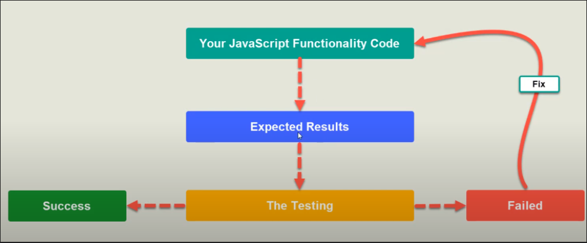

#### What is Unit Testing ?

Software testing method that break your software into pieces that can be tested individually to ensure it's validation.

`Unit` : is the smallest piece of your code that can be tested individually.

#### Testing Cycle :

#### Famous Testing Frameworks :

- [Jest.js](https://jestjs.io/)
- [Mocha.js](https://mochajs.org/)
- [Karma.js](https://karma-runner.github.io/latest/index.html)
- [Jasmine.js](https://jasmine.github.io/)

#### Types of Tests :

`Integration Test` : is a level of software testing where individual units or components of a software application are combined and tested as a group.

`End to End Test (E2E)` : is a level of software testing used to validate the entire software application from start to finish `(i.e. User End Testing). 

`Unit Test` : is a level of software testing where individual components or units of a software application are tested in isolation.

#### Index :

- [Getting Started](sections/getting_started.md)
- [Global Methods](sections/global_methods.md)
- [Matchers](sections/matchers.md)
- [Utilities](sections/utilities.md)
- [Asymmetric Matchers](sections/asymmetric_matchers.md)
- [Code Coverage](sections/code_coverage.md)
- [Mock Functions](sections/mock_functions.md)
- [Options](sections/options.md)

---