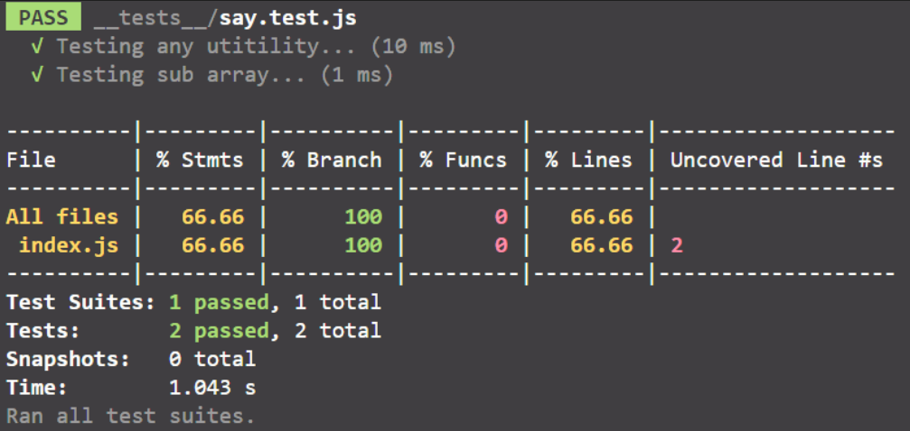
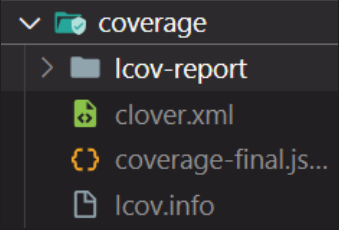

#### Jest Code Coverage :

`coverage` : is a process of collecting all reports about our unit tests that display uncovered lines to be reviewed again. we use the following command.

```shell
npm test -- --coverage
```



The preceding command creates a `coverage` directory that contains all reports about your unit tests.



We can automate the coverage process to be done after each modification you do in the `file.test.js` by adding jest options for the `package.json` file as follows.

```json
{
	...
	"jest": {
		"collectCoverage": true, // coverage process iteratively.
		"coverageReports": ['html'] // types of reports.
	}
}
```

Then we run the following command.

```shell
npm test
```

---