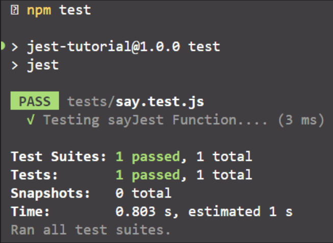

#### How to install jest.js ?

We can install `jest.js` using `npm` node package manager by typing the following command.

```shell
npm i jest --save-dev
```

The package will be saved the `package.json` file in the `devDependencies` section as following syntax.

```json
{
	...
	"devDependencies": {
		"jest": "^29.7.0"
	}
}
```

#### Getting Started :

`Test Driven Development (TDD)` :  is a software development approach that emphasizes writing tests **before** writing the actual code.

There are steps to follow that approach :

1. You write a failing test for a specific feature or functionality.
2. You write the minimum amount of code required to make the test pass.
3. You refactor the code to improve its design and maintainability.

Let us say that we have the following function

```javascript
// sayJest.js
const sayJest = () => {
	return 'Jest';
};

module.exports = {
	sayJest
};
```

And we need to check if that function returns `Jest` or not, so we will use three functions from `jest.js`  :

- `test(name, callback, timeout)` : is a function that is used to define a new unit test by passing the test name, test callback function and the timeout for the test.
- `expect(unit)` : is a function that takes the unit which will be tested.
- `toBe(output)` : is a function follows the `expect()` function to indicate the expected output for the unit test.

All unit tests are written in files with `.test.js` extension `(i.e. .js in case of using javascript and .ts in case of using typescript)` as following syntax.

```javascript
// sayJest.test.js
const {sayJest} = require('./sayJest.js');

// define a new unit test
test('Testing sayJest Function...', () => {
	expect(sayJest()).toBe('Jest');
});
```

Now we need to define the testing script in the `package.json` file as following syntax.

```json
{
	...
	"scripts": {
		"test": "jest"
	}
}
```

Type the following command in the terminal.

```shell
npm test
```

the command `jest` searching about available files with the pattern `*.test.[jt]s` and run these files as follows.



As you see the unit test passed successfully in `3 ms`.

`jest` command doesn't update the last modification for each unit test in your application. You need to use the option `--watchAll` to make `jest` updates it's unit tests meta data for each update you make.

```json
{
	...
	"scripts": {
		"test": "jest --watchAll"
	}
}
```

`test` has an alias called `it` and it's typed as the following syntax.

```javascript
// using the alias of the test() function.

it('Testing sayJest it Function....', () => {
  expect(sayJest()).toBe('Jest');
})
```
---