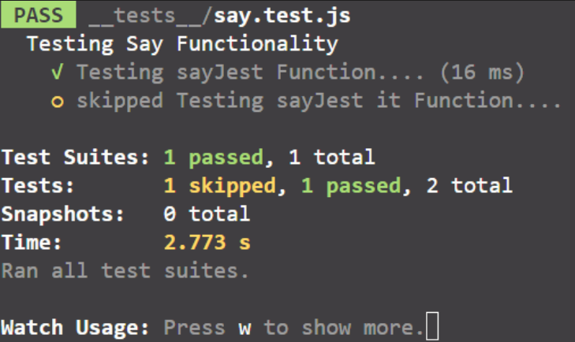
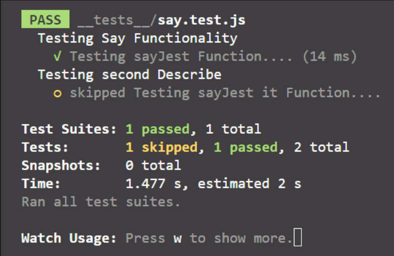
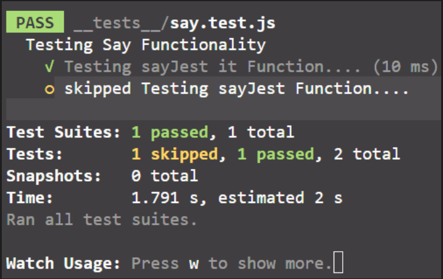
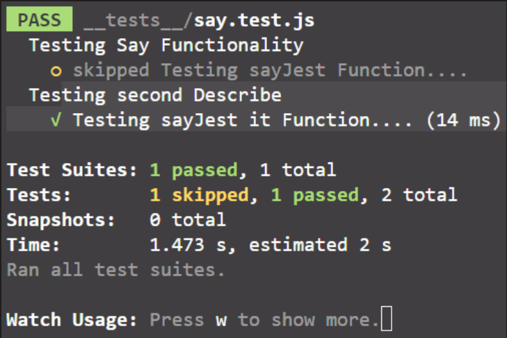
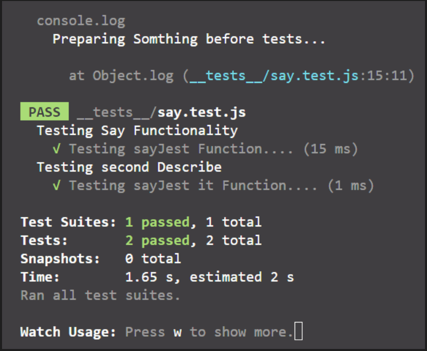
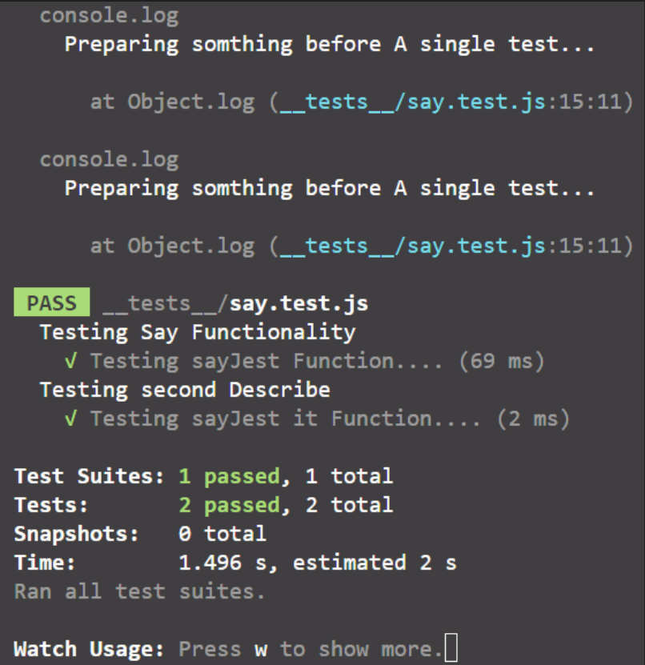
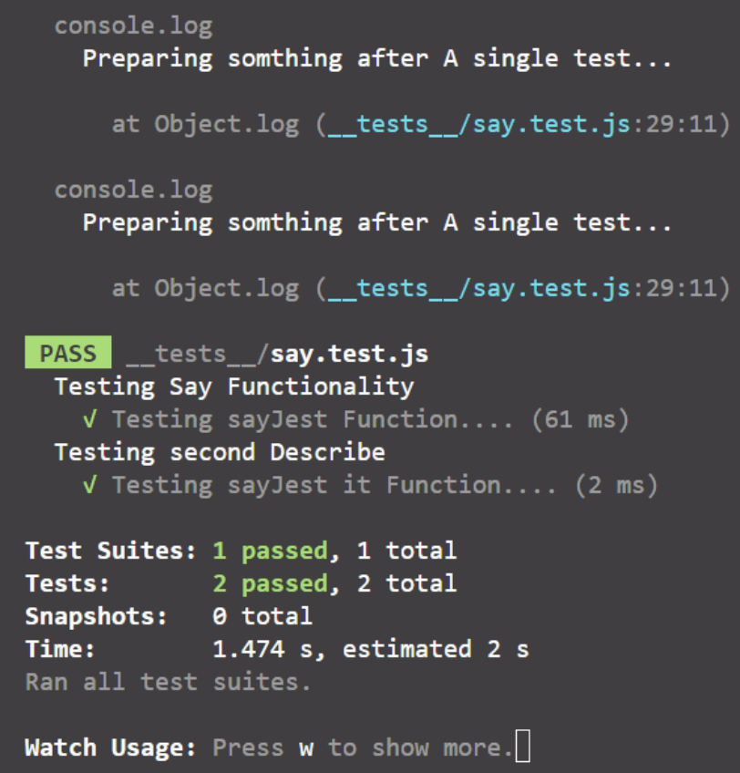

#### Jest Global Methods :

`test()` : is a global `jest` function that defines unit tests by passing the name, function, and timeout of the test and it has the alias `it()`. 

```javascript
// unit test declaration

test('test name', testFunc, timeout); 
```

`describe()` : is a global `jest` function that defines group of unit tests related to the same functionality by passing the name of the unit test group and the test function for the group.

```javascript
// unit test group declaration

describe('Testing Say Functionality', () => {
  test('Testing sayJest Function....', () => {
    expect(sayJest()).toBe('Jest');
  });
  it('Testing sayJest it Function....', () => {
    expect(sayJest()).toBe('Jest');
  });
});
```

> **Note:** we can do nested describe global function to make nested groups of unit tests.

`test.only()` : is a global jest method that executes only the its unit test entity not all the unit tests in the `file.test.js`.

```javascript
// testing only one test.

describe('Testing Say Functionality', () => {
  // executing the first test only
  test.only('Testing sayJest Function....', () => {
    expect(sayJest()).toBe('Jest');
  });
 
  it('Testing sayJest it Function....', () => {
    expect(sayJest()).toBe('Jest');
  });
});
```



`describe.only()` : is a global jest method that executes only its group of unit tests not all the group of unit tests in the `file.test.js`.

```javascript
// execute an only group of unit tests and skip the others

// execute it only that group of unit tests
describe.only('Testing Say Functionality', () => {
  test('Testing sayJest Function....', () => {
    expect(sayJest()).toBe('Jest');
  });
});

describe('Testing second Describe', () => {
  it('Testing sayJest it Function....', () => {
    expect(sayJest()).toBe('Jest');
  });
});
```



`test.skip()` : is a global jest method that skips the unit test and executes the rest of the `file.test.js`.

```javascript
// skip only one test

describe('Testing Say Functionality', () => {
  // skip that unit test
  test.skip('Testing sayJest Function....', () => {
    expect(sayJest()).toBe('Jest');
  });
 
  it('Testing sayJest it Function....', () => {
    expect(sayJest()).toBe('Jest');
  });
});
```


`describe.skip()` : is a global jest method that skips the group of unit tests and execute the rest of the `file.test.js`.

```javascript
// skip only group of unit tests

// skip that group of unit tests
describe.skip('Testing Say Functionality', () => {
  test('Testing sayJest Function....', () => {
    expect(sayJest()).toBe('Jest');
  });
});

describe('Testing second Describe', () => {
  it('Testing sayJest it Function....', () => {
    expect(sayJest()).toBe('Jest');
  });
});
```



`bedoreAll()` : is a global jest method that execute some tasks before executing all the unit tests of the `file.test.js`.

```javascript
// running something before all the tests

beforeAll(() => {
  console.log('Preparing Somthing before tests...');
});

describe('Testing Say Functionality', () => {
  test('Testing sayJest Function....', () => {
    expect(sayJest()).toBe('Jest');
  });
});

describe('Testing second Describe', () => {
  it('Testing sayJest it Function....', () => {
    expect(sayJest()).toBe('Jest');
  });
});
```



`beforeEach()` : is a global jest method that execute some task before executing each unit test in the `file.test.js`.

```javascript
// running something before each unit test

beforeEach(() => {
  console.log('Preparing somthing before A single test...');
});

describe('Testing Say Functionality', () => {
  test('Testing sayJest Function....', () => {
    expect(sayJest()).toBe('Jest');
  });
});

describe('Testing second Describe', () => {
  it('Testing sayJest it Function....', () => {
    expect(sayJest()).toBe('Jest');
  });
});
```



`afterAll()` : is a jest global method that executes some task after executing all unit tests in `file.test.js`.

```javascript
// running something after all the tests

afterAll(() => {
  console.log('Preparing Somthing after tests...');
});

describe('Testing Say Functionality', () => {
  test('Testing sayJest Function....', () => {
    expect(sayJest()).toBe('Jest');
  });
});

describe('Testing second Describe', () => {
  it('Testing sayJest it Function....', () => {
    expect(sayJest()).toBe('Jest');
  });
});
```

`afterEach()` : is a global jest method that execute some task after executing each unit test in `file.test.js`.

```javascript
// running something before each unit test

afterEach(() => {
  console.log('Preparing somthing after A single test...');
});

describe('Testing Say Functionality', () => {
  test('Testing sayJest Function....', () => {
    expect(sayJest()).toBe('Jest');
  });
});

describe('Testing second Describe', () => {
  it('Testing sayJest it Function....', () => {
    expect(sayJest()).toBe('Jest');
  });
});
```



---
